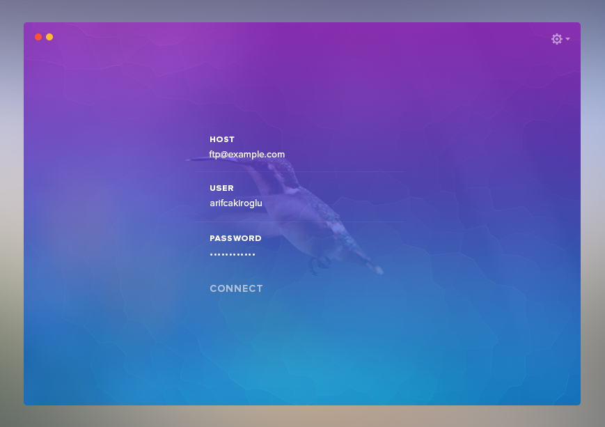
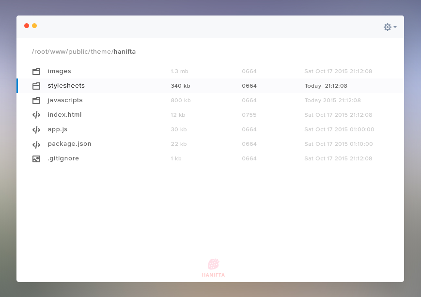

Minimal Ftp
==============

### Screenshots





# Quick start
The only development dependency of this project is [Node.js](https://nodejs.org). So just make sure you have it installed.
Then type few commands known to every Node developer...
```
git clone https://github.com/arifcakiroglu/minimal-ftp.git
cd minimal-ftp
npm install
npm start
```


# Development

#### Installation

```
npm install
```

#### Starting the app

```
npm start
```

# Making a release

To make ready for distribution installer use command:
```
npm run release
```
It will start the packaging process for operating system you are running this command on. Ready for distribution file will be outputted to `releases` directory.

You can create Windows installer only when running on Windows, the same is true for Linux and OSX. So to generate all three installers you need all three operating systems.


# License

The MIT License (MIT)

Copyright (c) 2015 Jakub Szwacz

Permission is hereby granted, free of charge, to any person obtaining a copy
of this software and associated documentation files (the "Software"), to deal
in the Software without restriction, including without limitation the rights
to use, copy, modify, merge, publish, distribute, sublicense, and/or sell
copies of the Software, and to permit persons to whom the Software is
furnished to do so, subject to the following conditions:

The above copyright notice and this permission notice shall be included in all
copies or substantial portions of the Software.

THE SOFTWARE IS PROVIDED "AS IS", WITHOUT WARRANTY OF ANY KIND, EXPRESS OR
IMPLIED, INCLUDING BUT NOT LIMITED TO THE WARRANTIES OF MERCHANTABILITY,
FITNESS FOR A PARTICULAR PURPOSE AND NONINFRINGEMENT. IN NO EVENT SHALL THE
AUTHORS OR COPYRIGHT HOLDERS BE LIABLE FOR ANY CLAIM, DAMAGES OR OTHER
LIABILITY, WHETHER IN AN ACTION OF CONTRACT, TORT OR OTHERWISE, ARISING FROM,
OUT OF OR IN CONNECTION WITH THE SOFTWARE OR THE USE OR OTHER DEALINGS IN THE
SOFTWARE.
